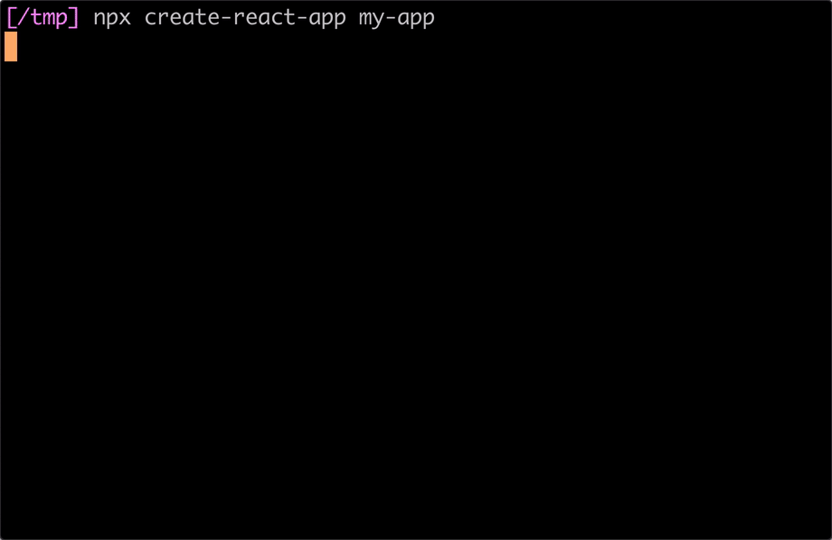
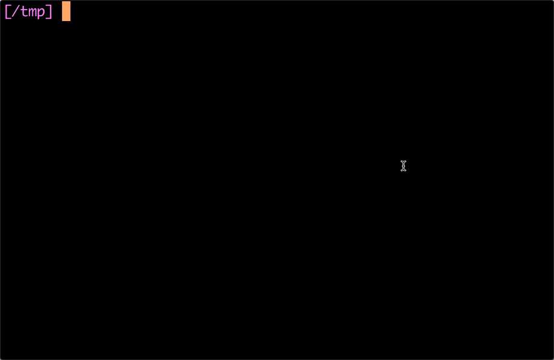

# Intro to Web Development with React.js

We are excited for you to join the Intro to Web Development with React.js. Below you will find a list of things to install or do on your computer *before* joining the workshop so that you are all ready to follow along.

## Prerequisites

| What                                           | Why                                                                                     |
| -------------                                  | -------------                                                                           |
| Google Chrome                                  | A standard web browser                                                                  |
| VSCode  or a similar code text editor          | To view and edit code with helpful features like syntax highlighting                    |
| Node.js                                        | To provide `node`, `npm`, `npx` command line tools that can be used to build React apps |
| A terminal application                         | To run commands that create and run React apps                                          |
| GitHub account and New GitHub repository       | Stores our code and serves our web page                                                 |
| Practice files downloaded from this repository | Allows you to copy and paste code or view easier than trying to copy from a PowerPoint  |

### Installing Google Chrome

1. To install Google Chrome, download from https://www.google.com/chrome/
1. When finished downloading, open the downloaded installer file and follow any instructions on screen to install the application.

### Install VSCode

1. To install VSCode, download from https://code.visualstudio.com/download
1. When finished downloading, open the downloaded installer file and follow any on screen instructions.
1. After installing, feel free to open the app and look around. This is like Microsoft Word, but for code instead of the documents or publications.

### Installing Node.js

#### MacOS

1. To install Node.js, download the installer from https://nodejs.org/en/download/
1. When finished downloading, open the installer and follow the on screen instructions to install Node.js.

#### Windows

1. To install Node.js, download the installer from https://nodejs.org/en/download/.
1. Select the "Windows Installer" that supports most users.
1. When finished downloading, open the installer and follow the on screen instructions to install Node.js.
1. **Note:** If you have problems getting Node installed, you may need to refer to [this help article from Microsoft](https://support.microsoft.com/en-us/office/determine-whether-your-computer-is-running-a-32-bit-version-or-64-bit-version-of-the-windows-operating-system-aac162a1-0cb3-46f2-888f-2f22897396ce#:~:text=System%20Information%20window-,Click%20Start%2C%20type%20system%20in%20the%20search%20box%2C%20and%20then,the%20System%20Type%20under%20Item.) to check if your computer is 32 bit or 64 bit.

### Using A Terminal

A terminal is used for running applications that do not have a GUI (or graphical user interface). We will use a "command line utility", or terminal application, to create and run our React.js app.

#### MacOS

On MacOS, you can open the terminal application by pressing the "Command" and "Space" keys at the same time and then typing the word "terminal". When you see the Terminal search result, you can click it or press enter to launch the terminal appplication which will show a mostly blank text based screen where you can start typing commands, and have them execute in a purely text based environment.

#### Windows

On Windows, you can open the terminal application by searching for "PowerShell" via your search bar. When you see the PowerShell search result, you can click it or press enter to launch the terminal appplication which will show a mostly blank text based screen where you can start typing commands, and have them execute in a purely text based environment.

### Install `create-react-app`

Open your terminal application and run the following commands:

`cd ~/Desktop`

`npx create-react-app my-app`

See below screen capture to follow along:

### Running the App

1. To run the app, first open the terminal app.
1. In the terminal app, run the following command: `cd ~/Desktop/my-app`. This changes directories to where your React app lives.
1. Run another command in the terminal: `npm start`. This will use the `npm` tool to start running your app.
1. When you are done, you can use CTRL+C to quit the running command line application. Or, you can close your terminal program.

See below screen capture to follow along:

### Viewing the App

Running `npm start` should have launched your browser window to a URL such as http://localhost:3000. If it didn't, you can navigate to this URL in your web browser and you should see the default React app.
